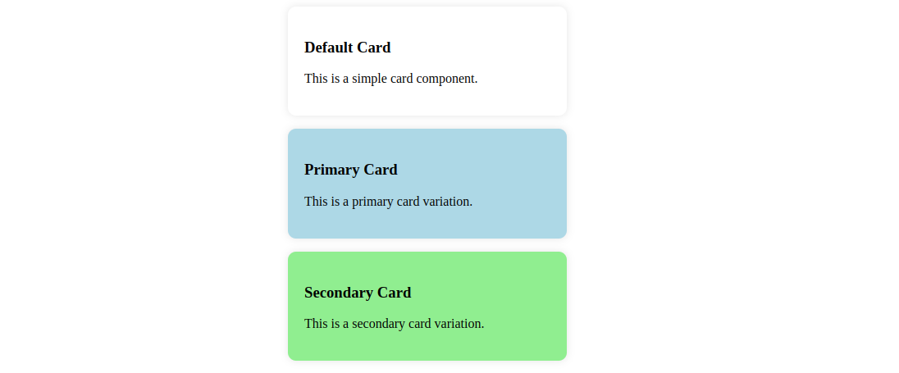

# Workshop Task 1: Styling with Basic CSS
## Objective
1. Use native CSS to style some HTML elements within `index.html`, using flexbox / grid.
2. Apply your styles to the HTML document by including the correct tag.

## Instructions
1. Check the `index.html` for its structure and elements to be styled.
1. Add CSS rules to style the elements according to the following design,
   displaying three card variants below each other: 

Hint: as colors you can use `#fff`, `lightblue`, and `lightcoral`.

3. Apply the stylesheet `styles.css` to your markup by including it in the `index.html`.

4. _For the pros (OPTIONAL):_ Use grid layout to arrange the cards in a 3x3 grid. You'll
   probably also need to add new elements to the HTML for that.

**To verify your solution:** Open the HTML with VSCode Live Server (right click on
`index.html` and select "Open with Live Server"). The Live Server will automatically reload your changes when you save.