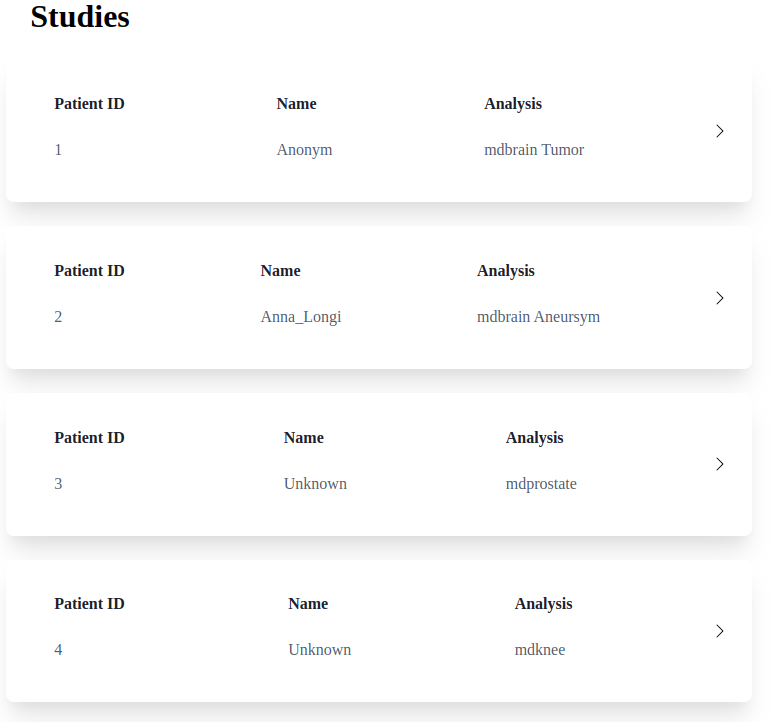

# Workshop Task 3: Tailwind CSS
## Objective

1. Refactor Sass-based React components using Tailwind CSS. 
2. Learn the concept & workflow of utility-first and understand what makes Tailwind CSS so popular.

## Prerequisites
- Install dependencies: `yarn`
- Run the dev server: `yarn dev`
- Install the [Tailwind CSS IntelliSense
  Plugin](https://marketplace.visualstudio.com/items?itemName=bradlc.vscode-tailwindcss)
  for VSCode. This is going to help you a lot (Copilot makes your life even
  easier). Note: there's also a Prettier plugin that automatically sorts the
  Tailwind classes according to best practices (we will skip that for now).
  
Opening http://localhost:5173 should look something like this: 

## Instructions

1. **Analyze code:** Open the `components` folder and analyze the code we are using here. It looks
   quite similar to our usual structure: for each component, we have a `.tsx`
   file (the React Functional Component), and a `.module.scss` file (the Sass
   module).
2. **Refactor components using Tailwind:** Remove the link between the React components and the Sass module (e.g.
   `{styles.card}`). Now, in the `className` you can add as many Tailwind
   utility classes you want to style the components based on the previous
   design. Feel free to use the docs: https://tailwindcss.com/docs
3. **(OPTIONAL):** Think about how the code can be optimized, e.g., by having
   less classes in the same component. Also you can apply the colors of our
   current web interface, by customizing the Tailwind theme, see
   https://tailwindcss.com/docs/adding-custom-styles#customizing-your-theme.

